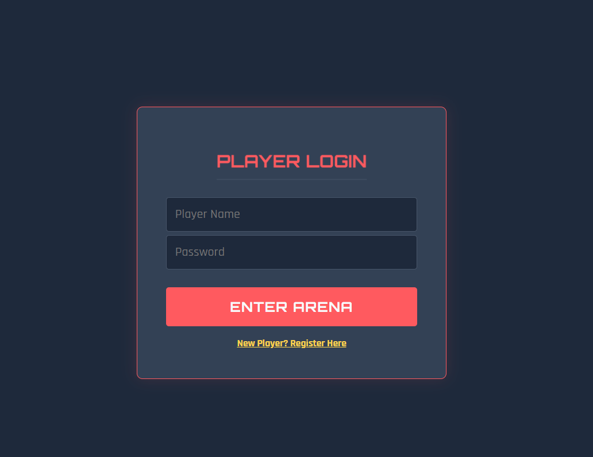
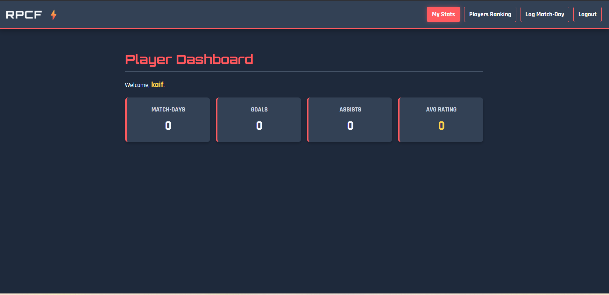
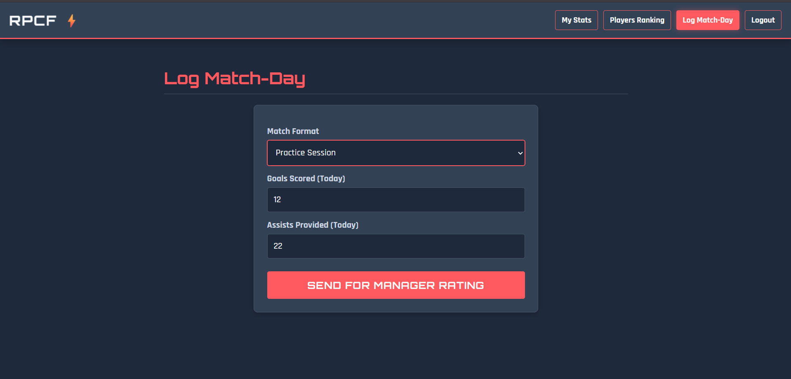
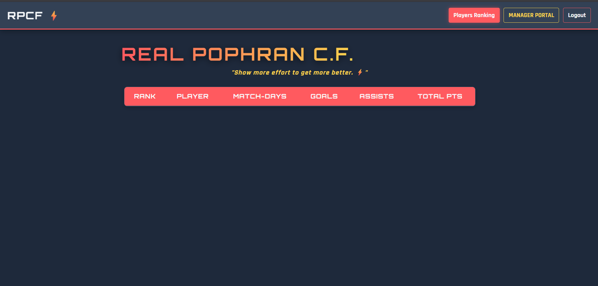

# ⚽ Real Pophran C.F. — Club Management System

> A full-stack web application built to manage a **real** football club — player stats, match ratings, points leaderboard, and manager approval workflows. Built by the Captain himself.

**Built by [Mohd Kaif Gawandi](https://github.com/kaifgawandi)** — Captain & Manager, REAL POPHRAN C.F.

---

## 🎯 Why I Built This

I manage REAL POPHRAN C.F. and organise the RPCF Sunday League. Tracking player stats, match performance, and squad rankings manually was getting messy. So I built a proper system — one that gives every player their own dashboard, lets me rate performances as Manager, and keeps a live leaderboard the whole squad can see.

This is a **real tool used by a real team** — not a tutorial project.

---

## 🖥️ Features

| Feature | Who Uses It |
|---|---|
| Player registration & login | All Players |
| Submit match stats (goals & assists) | Players |
| Personal performance dashboard | Players |
| Live squad rankings leaderboard | Everyone |
| Pending stats approval queue | Manager (Kaif) only |
| Manager rating system (0–10) | Manager (Kaif) only |
| Points multiplier by match type | System auto-calculated |

### 🏆 Points Multiplier System
```
Practice Match  →  Rating × 0.5
League Match    →  Rating × 1.0
Main Match      →  Rating × 2.0
```
A 9.0 rating in a Main Match = 18.0 points. Same rating in Practice = 4.5 points. Incentivises big-game performance.

---

## 🛠️ Tech Stack

| Layer | Technology |
|---|---|
| Backend | FastAPI (Python) |
| Database | SQLite with relational schema |
| Frontend | Vanilla HTML / CSS / JavaScript |
| Auth | Role-based (Manager vs Player) |
| API | 6 REST endpoints |

---

## 📁 Project Structure

```
real-pophran-cf/
├── main.py          → FastAPI backend (6 API endpoints)
├── db_setup.py      → Database schema + seed data
├── index.html       → Full frontend (auth, dashboard, rankings, manager panel)
└── rpcf_data.db     → SQLite database (auto-generated on setup)
```

---

## 🚀 How to Run Locally

```bash
# 1. Install dependencies
pip install fastapi uvicorn

# 2. Set up the database
python db_setup.py

# 3. Start the server
uvicorn main:app --reload

# 4. Open your browser
# Go to → http://localhost:8000
```

**Default Manager Login:**
```
Name:     Kaif
Password: admin123
Role:     Manager
```

---

## 🔌 API Endpoints

| Method | Endpoint | Description |
|---|---|---|
| POST | `/api/register` | Register new player |
| POST | `/api/login` | Login (player or manager) |
| POST | `/api/submit_stats` | Player submits match stats |
| GET | `/api/dashboard/{player_id}` | Player performance dashboard |
| GET | `/api/rankings` | Full squad leaderboard |
| GET | `/api/pending_stats` | Manager: view unrated submissions |
| POST | `/api/rate_player` | Manager: rate and approve stats |

---

## 🗄️ Database Schema

```
Users
├── user_id (PK, auto)
├── name (UNIQUE)
├── password
└── role (Manager / Player)

Stats
├── stat_id (PK, auto)
├── player_id (FK → Users)
├── match_type (Practice / League / Main)
├── goals
├── assists
├── manager_rating (0.0–10.0)
├── total_points (auto-calculated)
└── status (Pending → Rated)
```

---

## 🎨 UI Highlights

- Deep Navy + Coral Red + Gold colour scheme
- Orbitron & Rajdhani fonts — premium sports aesthetic
- Animated gradient title with moving shine effect
- Mobile-responsive layout with touch-friendly controls
- Role-based navigation (Manager panel hidden from players)
- Smooth page transitions with fade animations

---
## Screenshots

### Login



### Player Dashboard



### Players Ranking


### Log Match-Day



### Manager Control Panel


---

## 🔮 Planned Features

- [ ] Match date tracking for time-based stats filtering
- [ ] Player profile photo uploads
- [ ] Achievement badges (Top Scorer, Most Assists, etc.)
- [ ] Team performance analytics charts
- [ ] PWA support — installable on mobile devices
- [ ] Password hashing for production security

---

## 📫 Connect

- 🌐 Portfolio: [kaifgawandi.github.io](https://kaifgawandi.github.io)
- 💼 LinkedIn: [linkedin.com/in/kaif-gawandi](https://www.linkedin.com/in/kaif-gawandi/)
- 🐙 GitHub: [github.com/kaifgawandi](https://github.com/kaifgawandi)
